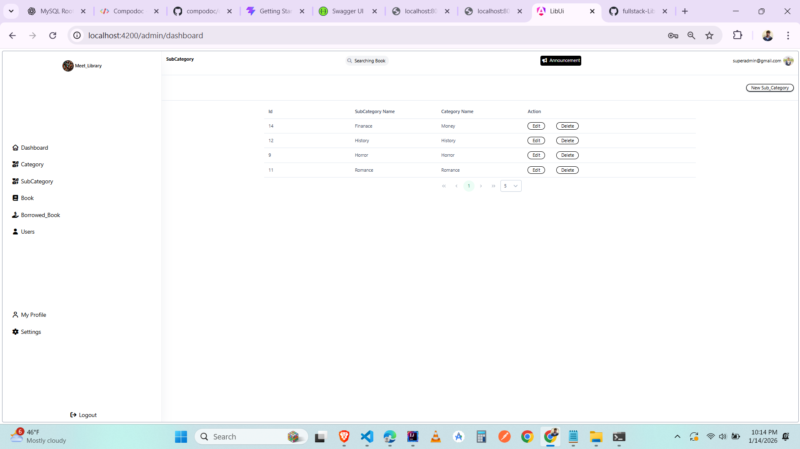
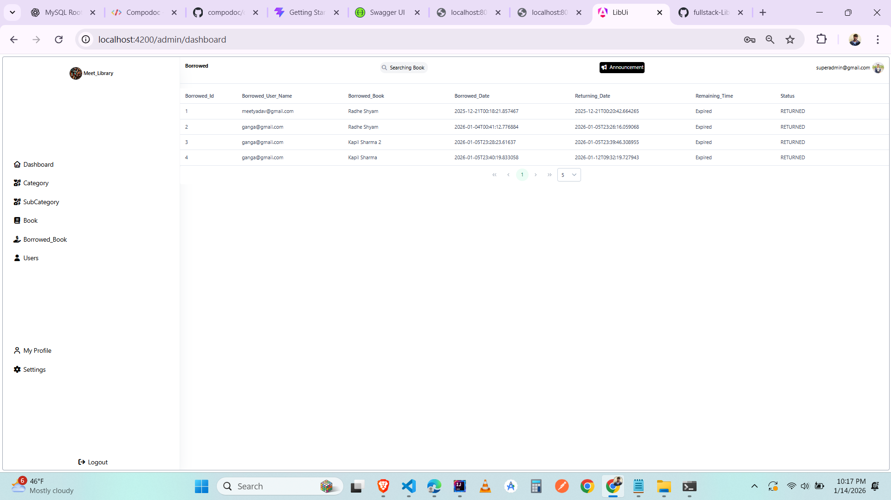
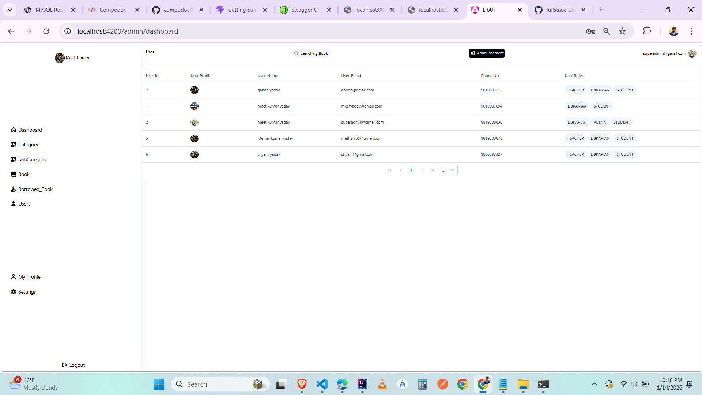
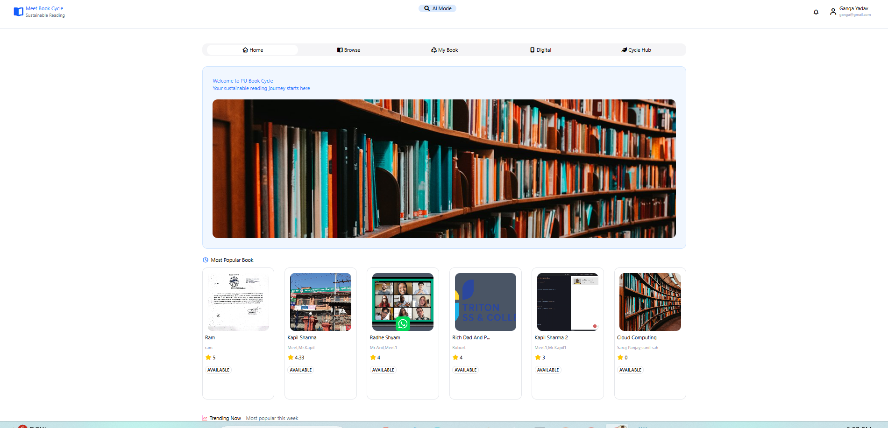
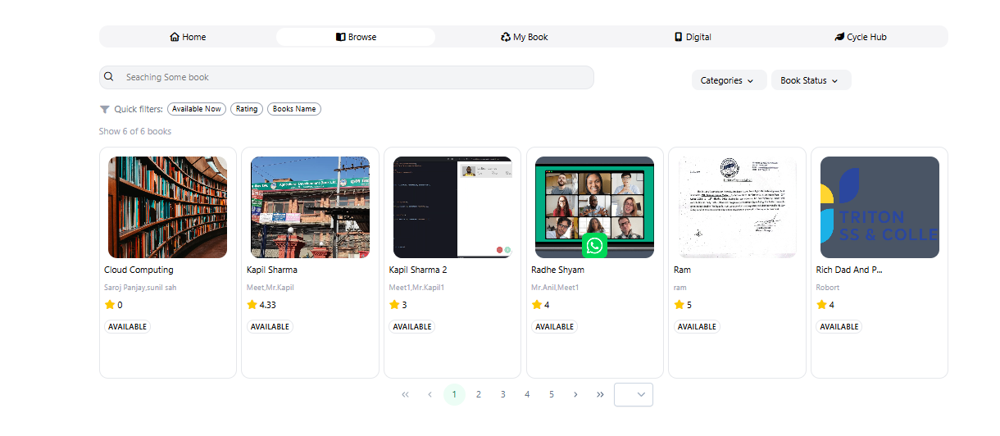

# 📚 LBM Library Management System

A full-stack Library Management System built with Angular and Spring Boot.

---

## 🅰️ Frontend (Angular)

### Tech Stack
- Angular
- TypeScript
- SCSS
- Docker + Nginx

### Run Development
```
npm install
ng serve
```

Open: [http://localhost:4200](http://localhost:4200)

### Auto Documentation
Generate docs: `npm run docs`  
Serve docs: `npm run docs:serve`  
Open: [http://localhost:4300](http://localhost:4300)

### Screenshots

### admin










### user






---

## ☕ Backend (Spring Boot)

### Tech Stack
- Spring Boot
- Spring Security
- MySQL
- Docker

### Run Backend
[http://localhost:8080](http://localhost:8080)

### API Documentation (Swagger)
[http://localhost:8080/swagger-ui.html](http://localhost:8080/swagger-ui.html)

---

## 🐳 Docker Full System

Run all services: `docker-compose up -d`  

Frontend: [http://localhost:4200](http://localhost:4200)  
Backend API: [http://localhost:8080/api/v1](http://localhost:8080/api/v1)

---

## 👤 Author
Methal Kumar Yadav 
Full Stack Java + Angular Developer  
Nepal 🇳🇵
